# Diagrama Entidad-Relación — CRM

> Schema real extraído de Supabase · CRM-Demo · Febrero 2026

---

## Mapa General por Dominio

```mermaid
erDiagram
    %% ═══════════════════════════════════════════
    %% DOMINIO 1 — PLATAFORMA MULTI-TENANT
    %% ═══════════════════════════════════════════

    TENANTS {
        bigint id PK
        text name
        text domain UK
        boolean is_active
        text logo_url
        text primary_color
        text primary_hover
        text accent_color
        boolean is_system
    }

    TENANT_MODULES {
        bigint id PK
        bigint tenant_id FK
        text module_key
        boolean is_enabled
    }

    TENANTS ||--o{ TENANT_MODULES : "habilita"

    %% ═══════════════════════════════════════════
    %% DOMINIO 2 — EQUIPO COMERCIAL
    %% ═══════════════════════════════════════════

    USERS {
        uuid id PK
        text email
        text full_name
        text role
        bigint tenant_id FK
        uuid comercial_id FK
        uuid supervisor_id FK
        boolean is_active
    }

    COMERCIALES {
        uuid id PK
        text name
        text email
        uuid user_id FK
        bigint tenant_id FK
        text ROL
        uuid supervisor_id FK
        uuid gerente_zona_id FK
        text region
        boolean is_active
    }

    TENANTS ||--o{ USERS : "pertenece a"
    TENANTS ||--o{ COMERCIALES : "pertenece a"
    USERS ||--o| COMERCIALES : "es"
    COMERCIALES ||--o{ COMERCIALES : "supervisa"
    USERS ||--o{ USERS : "reporta a"

    %% ═══════════════════════════════════════════
    %% DOMINIO 3 — CRM CORE
    %% ═══════════════════════════════════════════

    COMPANIES {
        bigint id PK
        text company_type
        text legal_name
        text trade_name
        text cuit UK
        text email
        text phone
        text address
        text city
        text province
        uuid comercial_id FK
        bigint tenant_id FK
        text status
        integer qualification_score
        text importance
        date client_since
        numeric credit_limit
        varchar file_number UK
    }

    CONTACTS {
        bigint id PK
        text first_name
        text last_name
        text email
        text phone
        text mobile
        uuid comercial_id FK
        bigint tenant_id FK
        text notes
    }

    CONTACT_COMPANIES {
        bigint id PK
        bigint contact_id FK
        bigint company_id FK
        boolean is_primary
        text role
        bigint tenant_id FK
    }

    OPPORTUNITIES {
        bigint id PK
        text opportunity_name
        numeric amount
        text status
        integer probability
        text product_type
        date close_date
        bigint company_id FK
        bigint contact_id FK
        uuid comercial_id FK
        bigint tenant_id FK
    }

    ACTIVITIES {
        bigint id PK
        text title
        text activity_type
        text priority
        text status
        date scheduled_date
        bigint company_id FK
        bigint contact_id FK
        bigint opportunity_id FK
        uuid comercial_id FK
        bigint tenant_id FK
        boolean auto_generated
    }

    EVENTS {
        bigint id PK
        text title
        date event_date
        text location
        bigint company_id FK
        bigint contact_id FK
        uuid comercial_id FK
        bigint tenant_id FK
    }

    SEGMENTS {
        bigint id PK
        bigint company_id FK
        text name
        numeric hectares
        text crops
        text machinery
        bigint tenant_id FK
    }

    NOTIFICATIONS {
        uuid id PK
        bigint tenant_id FK
        uuid user_id FK
        uuid comercial_id FK
        text type
        text priority
        text title
        boolean is_read
        boolean is_dismissed
    }

    FILE_ATTACHMENTS {
        bigint id PK
        text entity_type
        bigint entity_id
        text file_name
        text document_type
        text status
        uuid uploaded_by FK
        bigint tenant_id FK
    }

    TENANTS ||--o{ COMPANIES : "tiene"
    TENANTS ||--o{ CONTACTS : "tiene"
    COMERCIALES ||--o{ COMPANIES : "gestiona"
    COMERCIALES ||--o{ CONTACTS : "gestiona"
    COMPANIES ||--o{ CONTACT_COMPANIES : "tiene contactos"
    CONTACTS ||--o{ CONTACT_COMPANIES : "es contacto de"
    COMPANIES ||--o{ OPPORTUNITIES : "genera"
    CONTACTS ||--o{ OPPORTUNITIES : "participa en"
    COMERCIALES ||--o{ OPPORTUNITIES : "gestiona"
    OPPORTUNITIES ||--o{ ACTIVITIES : "tiene"
    COMPANIES ||--o{ ACTIVITIES : "tiene"
    CONTACTS ||--o{ ACTIVITIES : "tiene"
    COMPANIES ||--o{ EVENTS : "tiene"
    COMPANIES ||--o{ SEGMENTS : "tiene campos"
    TENANTS ||--o{ NOTIFICATIONS : "recibe"
    USERS ||--o{ NOTIFICATIONS : "recibe"

    %% ═══════════════════════════════════════════
    %% DOMINIO 4 — PIPELINE DE VENTAS
    %% ═══════════════════════════════════════════

    QUOTATIONS {
        bigint id PK
        varchar quotation_number
        bigint opportunity_id FK
        bigint company_id FK
        uuid comercial_id FK
        bigint tenant_id FK
        varchar status
        numeric subtotal
        numeric tax
        numeric total
        numeric tax_rate
        date delivery_date
    }

    QUOTATION_LINES {
        bigint id PK
        bigint quotation_id FK
        varchar product_name
        varchar product_sap_code
        numeric quantity
        numeric unit_price
        numeric subtotal
        numeric total
        numeric tax_rate
    }

    ORDERS {
        bigint id PK
        varchar order_number UK
        bigint quotation_id FK
        bigint company_id FK
        uuid comercial_id FK
        bigint tenant_id FK
        varchar status
        numeric subtotal
        numeric tax
        numeric total
        date delivery_date
    }

    ORDER_LINES {
        bigint id PK
        bigint order_id FK
        varchar product_name
        varchar product_sap_code
        numeric quantity
        numeric unit_price
        numeric subtotal
        numeric total
        text product_source
    }

    COMPROBANTES {
        uuid id PK
        bigint order_id FK
        integer tenant_id FK
        text tipo
        text letra
        integer punto_venta
        text cae
        text pdf_url
        numeric total
        boolean is_partial_payment
        numeric remaining_balance
        date fecha_emision
    }

    WAREHOUSES {
        uuid id PK
        bigint tenant_id FK
        text name
        text address
        boolean is_active
    }

    OPPORTUNITIES ||--o{ QUOTATIONS : "genera"
    COMPANIES ||--o{ QUOTATIONS : "recibe"
    COMERCIALES ||--o{ QUOTATIONS : "emite"
    QUOTATIONS ||--o{ QUOTATION_LINES : "contiene"
    QUOTATIONS ||--o{ ORDERS : "se convierte en"
    COMPANIES ||--o{ ORDERS : "genera"
    ORDERS ||--o{ ORDER_LINES : "contiene"
    ORDERS ||--o{ COMPROBANTES : "genera"
    TENANTS ||--o{ WAREHOUSES : "tiene"

    %% ═══════════════════════════════════════════
    %% DOMINIO 5 — TERRITORIO AGRÍCOLA
    %% ═══════════════════════════════════════════

    ESTABLISHMENTS {
        uuid id PK
        text name
        bigint company_id FK
        text location
        bigint tenant_id FK
    }

    LOTS {
        uuid id PK
        text name
        uuid establishment_id FK
        bigint prospect_id FK
        bigint client_id FK
        jsonb geometry
        numeric hectares
        text crop_type
        text campaign
        date sowing_date
        bigint tenant_id FK
    }

    COMPANIES ||--o{ ESTABLISHMENTS : "tiene"
    ESTABLISHMENTS ||--o{ LOTS : "contiene"
    COMPANIES ||--o{ LOTS : "prospecto en"
```



---

## Resumen por Dominio

| Dominio | Tablas | Descripción |
|---|---|---|
| **Multi-Tenant** | `tenants`, `tenant_modules` | Aislamiento por empresa. Cada tenant tiene módulos habilitados |
| **Equipo Comercial** | `users`, `comerciales` | Jerarquía: Gerente Zona → Supervisor → Comercial |
| **CRM Core** | `companies`, `contacts`, `opportunities`, `activities`, `events` | Prospects + Clientes + Contactos + Pipeline CRM |
| **Pipeline de Ventas** | `quotations`, `orders`, `comprobantes`, `warehouses` | Cotización → Pedido → Factura/Remito |
| **Territorio Agrícola** | `establishments`, `lots`, `segments` | Campos, lotes GeoJSON, segmentación |

---

## Flujo Principal del Negocio

```
PROSPECT (company_type='prospect')
    │
    ├── Actividades, Visitas, Eventos
    │
    ├── Oportunidad → Cotización → Pedido
    │                               │
    │                               └── Factura / Remito / Cobro
    │
    └── Conversión a CLIENT (company_type='client')
            │
            └── Legajo Digital (file_attachments)
```

---

## Claves de Diseño

> [!NOTE]
> **Multi-tenancy**: Cada tabla tiene `tenant_id` como columna de aislamiento. Las políticas RLS de Supabase garantizan que cada empresa solo vea sus propios datos.

> [!IMPORTANT]
> **companies** es una tabla unificada para Prospects y Clientes — se distinguen por el campo `company_type` ('prospect' | 'client'). La conversión solo cambia ese campo.

> [!TIP]
> **Jerarquía comercial**: `comerciales` es autorreferencial — un Comercial reporta a un `supervisor_id`, que a su vez reporta a un `gerente_zona_id`.
