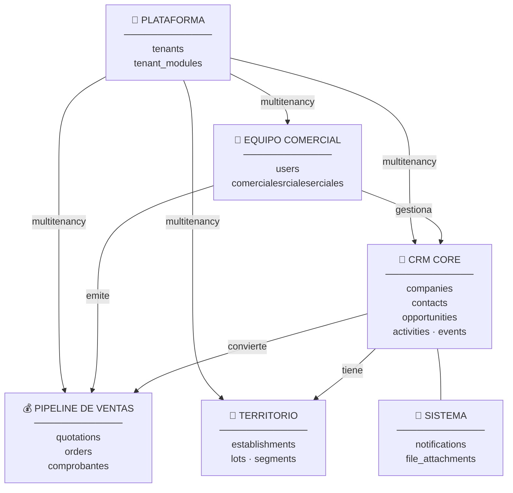
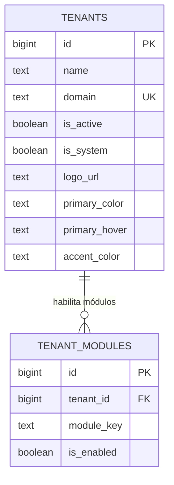
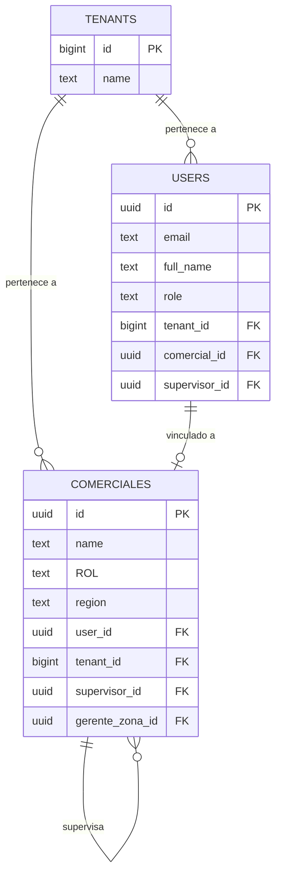
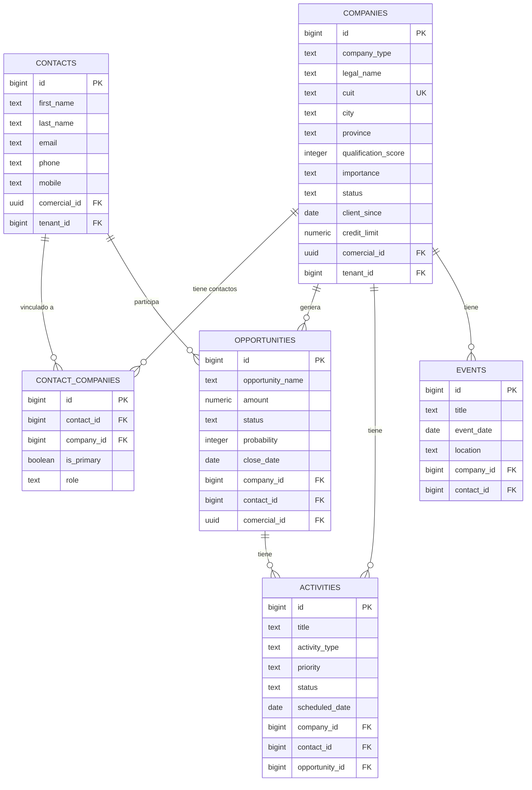
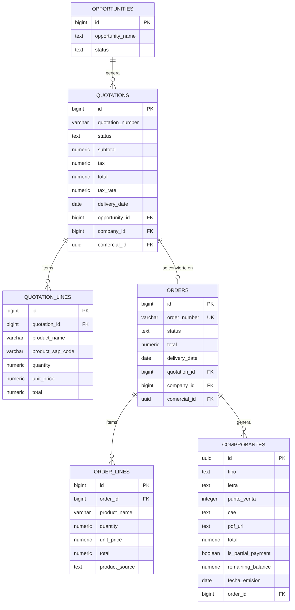
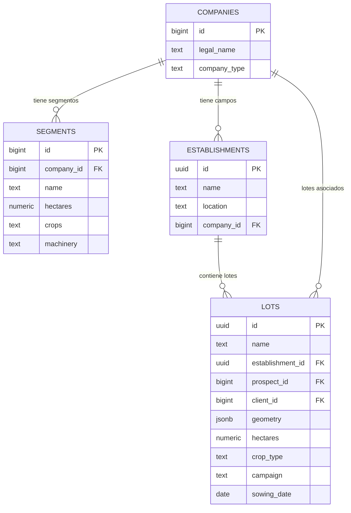

# Diagrama Entidad-Relación — CRM

> Schema real · Supabase CRM-Demo · Febrero 2026

---

## Vista General de Dominios

---

## 1 · Plataforma Multi-Tenant

---

## 2 · Equipo Comercial

> **Jerarquía de roles:** `super_admin` → `admin` → `gerente_zona` → `supervisor` → `user`

---

## 3 · CRM Core

> `company_type` = **'prospect'** o **'client'** — misma tabla, mismo registro, solo cambia el campo al convertir.

---

## 4 · Pipeline de Ventas

> **Flujo:** Oportunidad → `Cotización` → `Pedido` → `Comprobante` (FACTURA / REMITO / COBRO)

---

## 5 · Territorio Agrícola

> `geometry` en `lots` almacena polígonos **GeoJSON** para visualización en mapa.

---

## Tabla de Referencia Rápida

| Tabla | Filas aprox. | Descripción |
|---|---|---|
| `tenants` | 6 | Empresas cliente del CRM |
| `tenant_modules` | 44 | Módulos habilitados por tenant |
| `comerciales` | 19 | Representantes comerciales |
| `users` | 12 | Usuarios del sistema |
| `companies` | 1.205 | Prospects y Clientes |
| `contacts` | 13 | Personas de contacto |
| `contact_companies` | 6 | Relación Contacto ↔ Empresa |
| `opportunities` | 6 | Oportunidades de venta |
| `activities` | 9 | Llamadas, reuniones, tareas |
| `quotations` | 5 | Cotizaciones |
| `orders` | 7 | Pedidos confirmados |
| `comprobantes` | 6 | Facturas, remitos, cobros |
| `establishments` | 4 | Campos agrícolas |
| `lots` | 4 | Lotes con GeoJSON |
